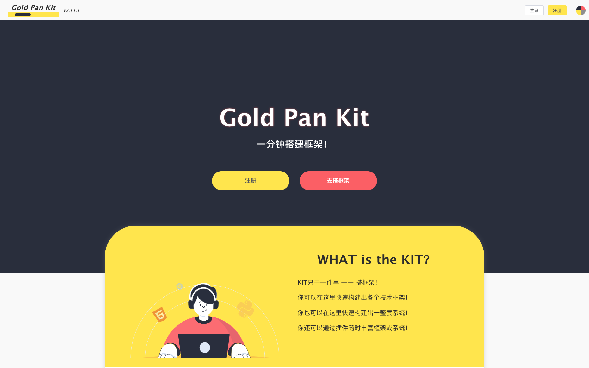
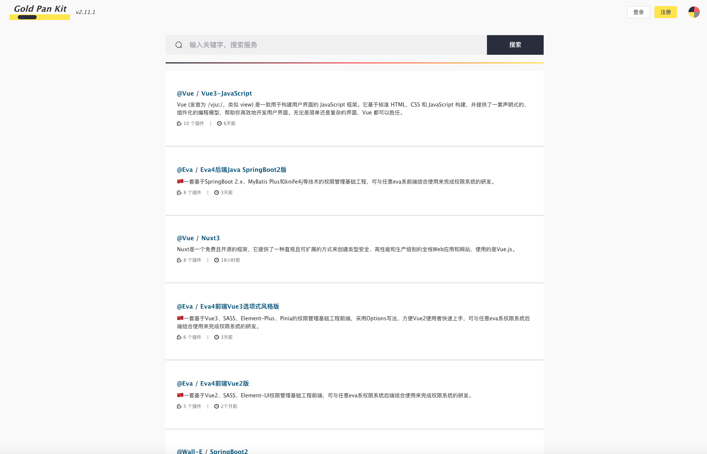
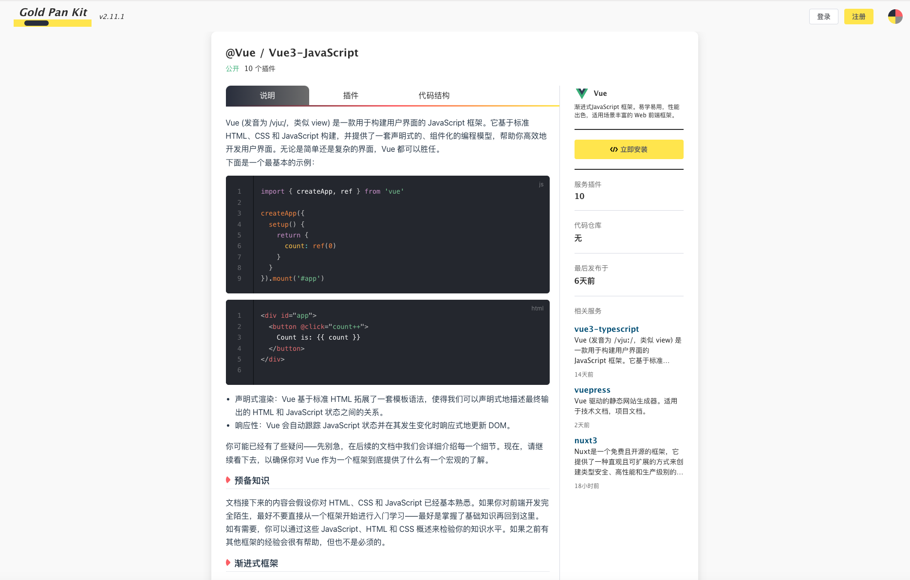
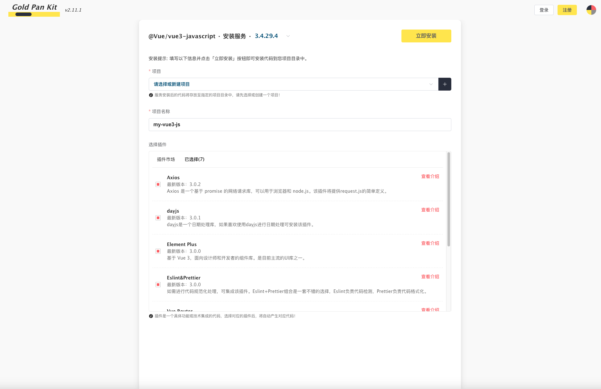
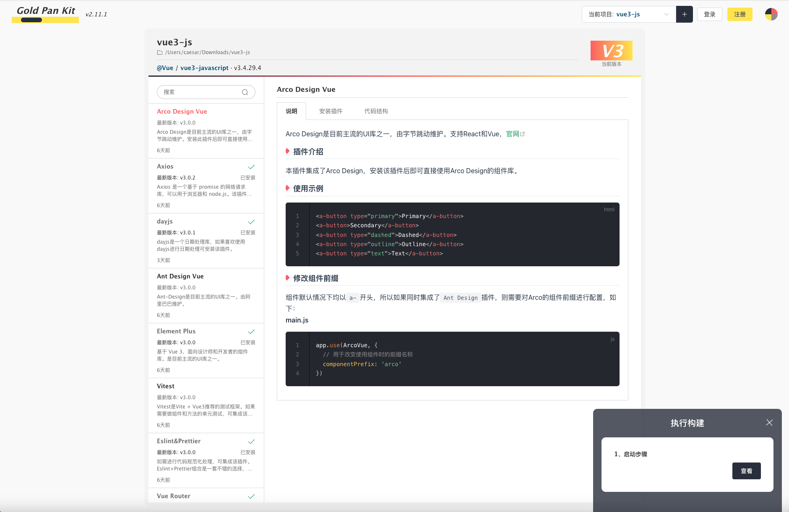
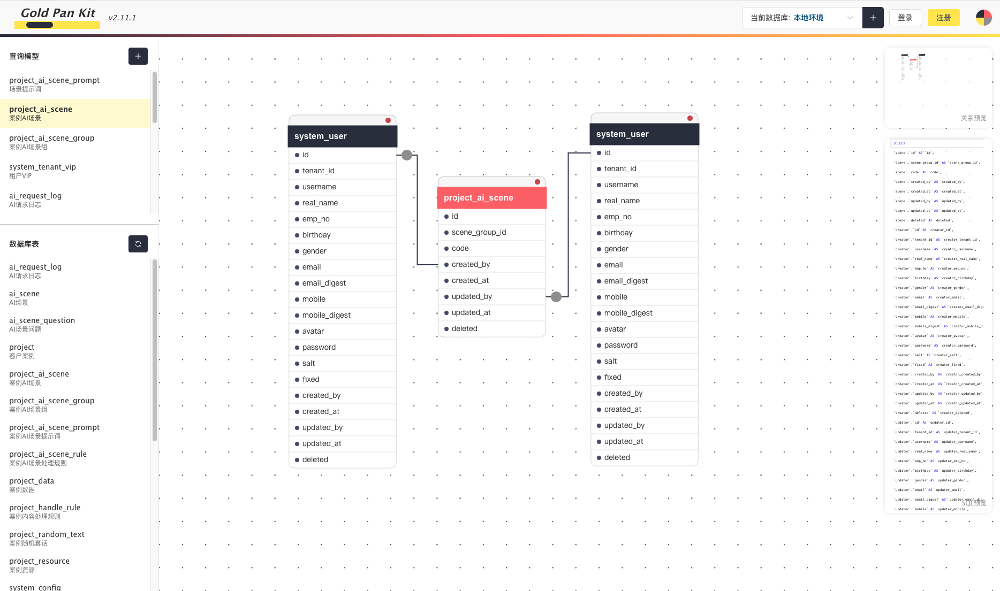

<div align="center">
  
  <h1>GoldPanKit - One-minute, Build a framework!</h1>
</div>

<div align="center">

English | [简体中文](./README.zh-CN.md)

</div>

## Introduction
GoldPanKit, developed by the Tsinghua Strait Research Institute and the original team from CodeRd, is a comprehensive development toolkit that offers a range of features to streamline and enhance the software development process. Here's a brief overview of its capabilities:

One-click framework construction: Quickly set up the initial structure of your software framework with a single command.
Plugin development support: Enable the creation of additional functionalities through plugins that can be seamlessly integrated into the framework.
Framework upgrade with one click: Simplify the process of updating the framework to the latest version with minimal effort.
Code generation for single and multiple tables: Automate the generation of code based on database tables, whether you're working with a single table or multiple tables.
Direct database connection: Facilitate a straightforward connection to the database, with the ability to automatically initialize database scripts.
Direct file system connection: Eliminate the need for manual downloading, unzipping, copying, and pasting by connecting directly to the file system.

## Online
Visit the [official website](http://www.goldpankit.com) to experience the one-minute setup of mainstream frameworks.

## Experience the powerful client-side on NPM.
Execute the following commands in the terminal sequentially.
```
npm install goldpankit -g --registry https://registry.npmmirror.com
kit
```

After successful execution, the Kit site will open automatically. Subsequently, to use Kit, simply run the kit command.


 **Precautions** 

- 1. Due to the possibility of multiple drives in the Windows system, you need to switch to the drive where your project is located when executing commands; otherwise, you won't be able to select your project directory.
- 2. If you encounter the error "ER_NOT_SUPPORTED_AUTH_MODE: Client does not support authentication protocol requested by server; consider upgrading MySQL client" when connecting to the MySQL database, it is caused by the unsupported database authentication protocol. You can modify the database password with the following command:
```sql
alter user 'root'@'localhost' identified with mysql_native_password by 'your password';
```

 **Version Update**

After re-executing the kit command in the terminal, kit will automatically check for updates and perform them. Once the update is successful, execute the kit command again. If the update fails, it is likely due to lack of permissions; try opening the terminal as a superuser and re-executing the kit command.

## Starting the Project

#### Project Directory

- node-service：Local service project
- node-page：Page project

#### Starting node-service
```shell
npm install --registry https://registry.npmmirror.com
npm link
kit
```

#### Starting node-page
```shell
npm install --registry https://registry.npmmirror.com
npm run serve
```

## Preview of the Project
After the project is successfully started, you can access the homepage by visiting `http://localhost:5173/`.






